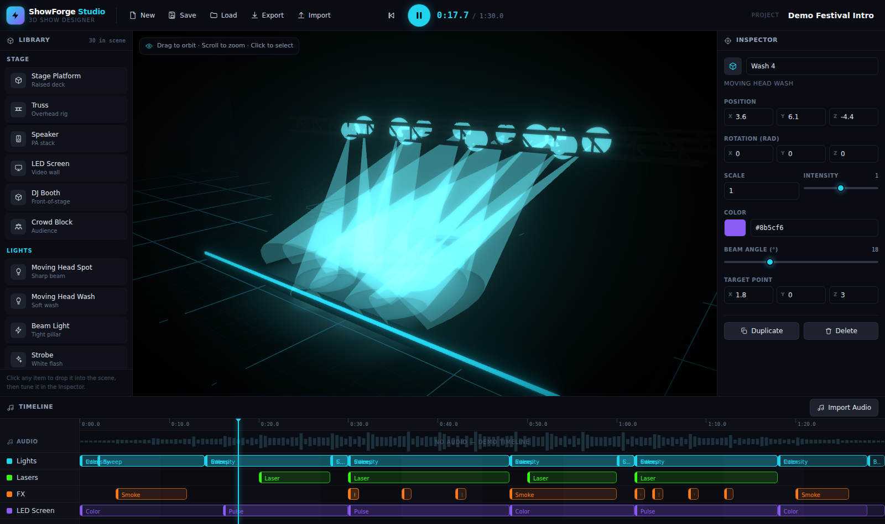

# ShowForge Studio

A web-based **3D stage & show simulator** for designing music, light and FX
shows — in the spirit of Depence / Capture / L8, simplified and modernised for
the browser. Build a stage, rig it with lights, lasers, LED walls and pyro,
program a synchronised timeline, import a track and hit **Play** to preview the
whole show in real time.



> V1 — fully client-side. No backend, no accounts. Projects live in your
> browser's `localStorage` and can be exported / imported as JSON.

---

## Quick start

```bash
npm install      # install dependencies
npm run dev      # start the dev server  →  http://localhost:5173
npm run build    # type-check + production build into dist/
npm run preview  # serve the production build locally
npm run lint     # type-check only (tsc --noEmit)
```

Open the dev URL and you'll land straight in **“Demo Festival Intro”** — a full
rig with a ~90s programmed show. Press **Space** (or the round Play button) and
watch the lights, lasers and FX fire on the timeline, even with no audio loaded.

---

## Tech stack

| Concern        | Choice                                   |
| -------------- | ---------------------------------------- |
| UI             | React 18 + TypeScript + Vite             |
| 3D             | Three.js · @react-three/fiber · drei     |
| Post-processing| @react-three/postprocessing (Bloom)      |
| State          | Zustand                                  |
| Styling        | Tailwind CSS (custom dark theme)         |
| Audio          | Web Audio API (HTMLAudio + AnalyserNode) |
| Persistence    | `localStorage` + JSON export/import      |

---

## Architecture

```
src/
  components/
    layout/      AppShell, TopBar, LoadProjectModal
    library/     ObjectLibrary (left sidebar)
    scene/       SceneViewport, StageScene, SceneObject, LightFixture,
                 LaserFixture, Smoke/Flame/CO2/Confetti effects, LedScreen,
                 static props, particle system, ShowStateContext
    inspector/   InspectorPanel (right sidebar)
    timeline/    TimelinePanel, EventBlock, EventEditor, AudioControls
    ui/          Icon, fields, Modal, Toasts
  store/
    useShowStore.ts   single Zustand store (document + selection + playback)
  types/
    show.ts           Project / SceneObject / ShowEvent models
  utils/
    audio.ts          AudioEngine (play/seek/level/waveform peaks)
    events.ts         event engine → live ShowState snapshot
    project.ts        save / load / export / import / sanitize
    usePlaybackClock  single rAF clock driving currentTime
  data/
    catalog.ts        object catalog + factories + event metadata
    demoProject.ts    the bundled demo show
```

### How the show runs

1. A **single `requestAnimationFrame` clock** (`usePlaybackClock`) advances
   `currentTime` — following the audio element when a track is loaded, or a
   virtual clock otherwise (so the demo plays with no audio).
2. Each frame, `StageScene` calls **`evaluateEvents(events, time)`** which folds
   the timeline into a flat **`ShowState`** (light colors/intensity/strobe/sweep,
   laser state, LED color/pulse, active FX bursts, blackout).
3. That snapshot is shared through a **ref + React context**, so every fixture
   reads it inside its own `useFrame` — the heavy 3D never causes React
   re-renders during playback. UI bits that show time (playhead, clock) subscribe
   to the store directly and stay cheap and isolated.

Two event semantics: **state events** (color/intensity) persist until the next
one; **window events** (strobe/sweep/bursts/blackout) are active only for their
clip duration.

---

## Two modes: Build & Show

A switch in the top bar flips between the two ways you work on a show:

- **Build mode** — a construction sandbox (the timeline is hidden, work light
  comes on). A bottom **build toolbar** gives you a **grid** (show/hide + cell
  size), **grid snapping**, **magnetic snapping** (objects click flush against
  each other's faces and auto-align their centres, like magnets) and
  **collisions** — each independently toggleable, in the spirit of Planet
  Coaster's building tools. Assemble a clean, believable rig without touching
  the timeline.
- **Show mode** — the timeline / playback programming from V1: tracks, clips,
  audio, transport.

## Features

- **3D viewport** — orbit / zoom / pan, grid floor, fog, ACES tone-mapping and
  bloom; click to select, transform gizmo on the selection.
- **Object library** — 18 object types across Stage / Lights / FX, one click to
  add to the scene, including **vertical structures** (truss towers, arches).
- **Realistic gear** — fixtures are modelled to read like real touring hardware:
  moving heads with a base, U-yoke and a tilting lit head; beam fixtures; LED
  strobe panels; 2×2 blinder lamp arrays; a laser projector with heat-sink fins
  and an aperture window; box-truss lattices (horizontal beams, vertical towers
  and goalpost arches); flown PA line-arrays; and dedicated FX machine bodies
  (hazer, flame canister, cryo bottle, confetti blower).
- **Power tools** — Shift-click to multi-select; then align to the anchor,
  distribute evenly, duplicate, **array** (N copies along an offset) and
  **mirror** the selection across the stage centre. Move the whole selection
  with the gizmo. `Ctrl/Cmd+D` duplicates.
- **Rigging** — clip a light / laser onto a truss (drop it straight onto the
  structure, or pick a parent in the inspector); moving the structure carries
  its rigged fixtures with it.
- **Volumetric lights** — a real SpotLight + additive beam cone,
  color/intensity/beam-angle/target, movement animation and a global strobe flash.
- **Lasers** — animated additive beam fans / drawn chains, per-fixture color.
- **FX** — GPU-light particle smoke, flame, CO2 and confetti bursts.
- **LED screen** — custom shader wall that changes color, pulses and reacts to
  the music level.
- **Inspector** — edit name, position, rotation, scale, color, intensity, beam
  angle and target; duplicate / delete.
- **Timeline** — Lights / Lasers / FX / LED tracks, real audio waveform (or a
  faux pattern for the demo), second ruler, draggable event clips, scrub
  playhead, per-track “add event”, full event editor (track/type/target/time/
  duration/params).
- **Audio** — import a local file, play / pause / stop / seek, analyser-driven
  reactivity, clean teardown. The track is **kept in IndexedDB per project**, so
  a saved show plays back with its audio after a reload — no re-importing.
- **Projects** — New (with confirm), Save / Load via `localStorage`, Export /
  Import JSON, defensive sanitisation of loaded files.
- **Shortcuts** — `Space` play/pause, `Delete`/`Backspace` remove selection,
  `Ctrl/Cmd+D` duplicate, `Ctrl/Cmd+Z` undo / redo, `W`/`E` move / rotate.

---

## Current limitations

- Particle FX and beams are stylised, not physically accurate.
- The audio waveform is sampled at load (no live re-decode); very long files
  take a moment to analyse.
- Audio blobs live in IndexedDB (per browser); they are not embedded in the
  exported JSON, so a shared export still needs its track re-imported.
- Single large JS bundle (Three.js) — no code-splitting tuning yet.

## Possible next steps

- Drag-and-drop from the library into the 3D scene with placement gizmos.
- Transform gizmos (move/rotate) in the viewport.
- Undo/redo history and multi-select.
- Beat grid / BPM snapping and copy-paste of timeline clips.
- More fixtures (gobos, pixel bars), beam textures and reflective floor.
- Optional backend for cloud project storage and audio hosting.
